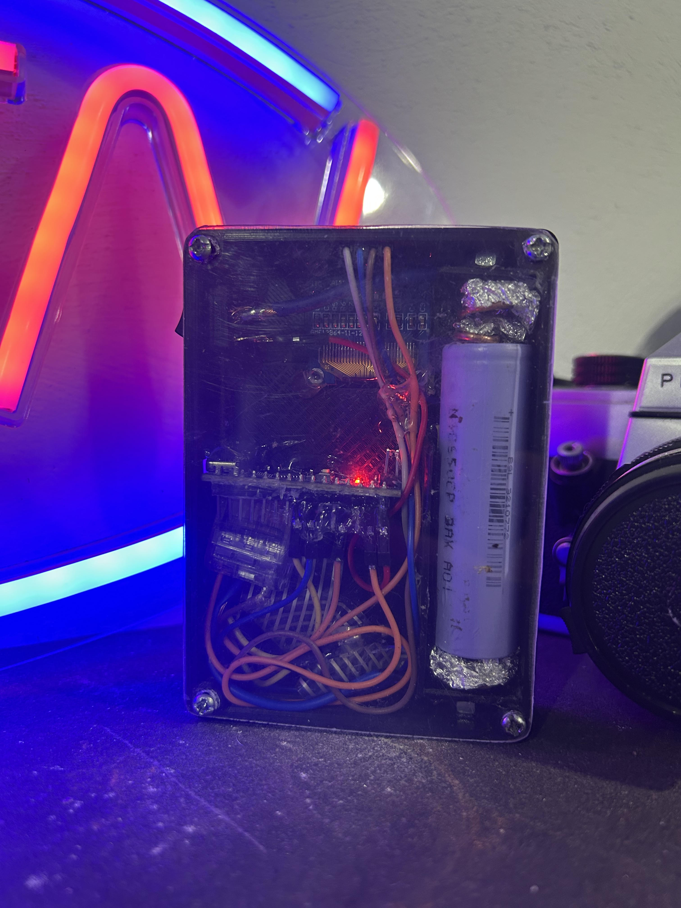
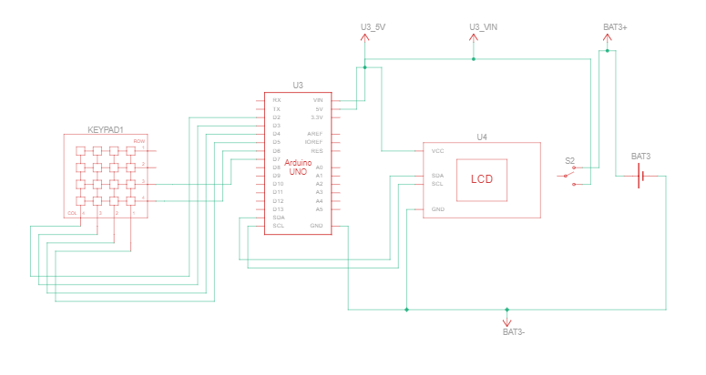

# Calculator_Arduino
## General info
 Calculator arduino power 18650 3.7v 
	
## Technologies
Project is created with:
* C/C++
 
## Setup
To run this project, install arduino ide to upload code to arduino nano.

## The most important photos

## electronic Schematic

